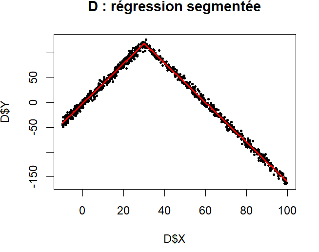
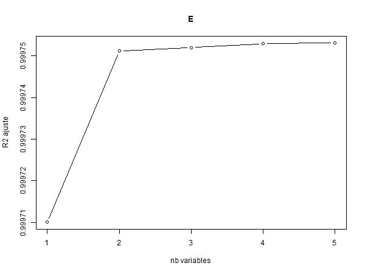

# 📈 ProbaProjet: Linear Regression, Student versus AI

[](https://github.com/evrardlecureur/ProbaProjet/actions/workflows/ci.yml)
[](https://github.com/evrardlecureur/ProbaProjet/actions/workflows/codeql.yml)
[](https://github.com/evrardlecureur/ProbaProjet/releases)
[](LICENSE)


What does an AI add to a third-year student's linear regression, and where does the student's reasoning still matter?

This project fits **linear models in R** on seven datasets provided by the instructor: simple regression with its inference and residual diagnostics, multiple and polynomial regression, ANOVA and variable selection. Its particularity is the **two-pass method**: every part is first done by the students alone (a *partie étudiant* block in each script), then redone with AI assistance (a *partie IA* block), and each section of the report ends with a comparison of the two approaches.

| Context | Authors |
| --- | --- |
| Linear regression project (MAM3), May 2026, Polytech Nice Sophia (Université Côte d'Azur) | Evrard Lecureur, Romain Ben, Thibaud Crotta |

## 📸 Preview

| Dataset D: a V-shaped relation, the break point estimated by segmented regression | Dataset E: adjusted R² of the best model of each size |
| --- | --- |
|  |  |

## 🎯 What Each Dataset Teaches

| Dataset | Question | Student approach | What the AI pass adds |
| --- | --- | --- | --- |
| A | The ideal case | `lm()`, Student test on the slope, rejection region, studentized residuals, QQ-plot, Kolmogorov-Smirnov | Least squares formulas checked by hand, Breusch-Pagan and Shapiro-Wilk tests, prediction intervals |
| B | Outliers | Residuals beyond 3 removed, the model refitted | Cook's distance (influence rather than size), robust regression `rlm()` compared with removal |
| C | Small sample (n = 50) | Wider confidence interval of the slope | Robust standard errors (`sandwich`), bootstrap confidence interval (2000 resamples) |
| D | V-shaped relation | A single line fails; two lines split at X = 30 | Segmented regression with the break point estimated (`segmented`), piecewise model with one `lm()` |
| E | Five predictors | Multiple regression, a predictor dropped on its p-value, nested F-test | Backward selection by AIC, VIF for multicollinearity, Breusch-Pagan |
| D again | Curvature | Quadratic model, F-test against the line | Degrees 2 to 4 compared by AIC, orthogonal polynomials |
| G | Qualitative factors | One- and two-way ANOVA with interaction | Tukey post-hoc test, the quantitative variable kept instead of binned, Levene test |
| E, F, G | Variable selection | Exhaustive search by adjusted R² (`leaps`), forward and backward | Stepwise selection by AIC in three directions, VIF |

The report (`rapport.tex`, in French) follows the same three parts, with a comparison paragraph at the end of each section.

## 🚀 Getting Started

Requires R 4.x and [Tectonic](https://tectonic-typesetting.github.io/) for the report. The datasets (`Data1.R` to `Data4.R` for datasets A to D, `data5.RData` to `data7.RData` for E to G) are provided by the instructor and are **not** in the repository.

```bash
git clone https://github.com/evrardlecureur/ProbaProjet.git
cd ProbaProjet
Rscript -e 'install.packages(c("leaps", "car", "lmtest", "MASS", "sandwich", "boot", "segmented"))'
```

Load the datasets in an R session, then run the scripts in the order of the report:

```r
source("Data1.R"); source("Data2.R"); source("Data3.R"); source("Data4.R")   # A, B, C, D
source("code/script_romain.R")    # simple regression
source("code/script_thibaud.R")   # multiple, polynomial, ANOVA
source("code/script_evrard.R")    # variable selection (loads data5 to data7 itself)
```

Build the report:

```bash
tectonic -X compile rapport.tex   # writes rapport.pdf
```

The compiled report is attached to each [release](https://github.com/evrardlecureur/ProbaProjet/releases).

## 📁 Repository Structure

```text
ProbaProjet/
├── code/
│   ├── script_romain.R      # simple regression, inference, residuals (datasets A to D)
│   ├── script_thibaud.R     # multiple and polynomial regression, ANOVA (E, D, G)
│   └── script_evrard.R      # variable selection (E, F, G)
├── figures/                 # 27 figures produced by the scripts, used by the report
├── rapport.tex              # report (French), student-versus-AI comparison in each section
├── .github/                 # CI, CodeQL, Dependabot, issue forms, pull request template
├── CITATION.cff             # citation metadata
└── CHANGELOG.md             # history of the versions
```

## ✅ Quality

- **CI** (`.github/workflows/ci.yml`): the R scripts are parsed (the datasets are not in the repository, so they cannot run here), the report is built with Tectonic and uploaded as an artifact, the Markdown files are checked with markdownlint and lychee.
- **CodeQL** on the workflows, **Dependabot** for the GitHub Actions.

## 👥 Authors

| Member | Part |
| --- | --- |
| Evrard Lecureur | Coordination, variable selection |
| Romain Ben | Simple regression, inference, residual diagnostics, special cases |
| Thibaud Crotta | Multiple and polynomial regression, ANOVA |

## 📄 License

This project is licensed under the [MIT License](LICENSE). The datasets belong to the course and are not distributed here.
